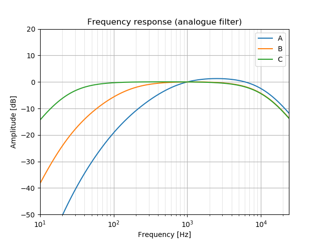

# IIR coefficients for A,B,C and ITU_R_468 weighting filters

Two modules which provide the zpk coefficients for the
A,B,C and ITU_R_468 weighting filters. These can then
be used by `signal.lfilter` to filter audio signals.

In contrast to other implementations which get the high frequency end
completely wrong (because of the bilinear transform) here I have used
the matched z-transform which aims to match 1:1 the analogue and
digital frequency response.

The precision towards the Nyquist frequency depends on the sampling rate
but given that audio has such low energy over 10kHz there is probably not much
point to it. In addition the analogue frontend will introduce
additional damping towards Nyquist and the errors might just cancel out.

On the other hand lower sampling rates (fs >= 2kHz) can be used
if only low frequency noise has been measured.

## Installation

It's on pypi. Just run:
```
pip install sound_weighting_filters
```

or if you prefer to install from this git Rep:
```
python setup install [ --user ]
```

## Usage

```
import ABC_weighting
import ITU_R_468_weighting
```

Both modules have a single function to get the zpk coefficients.
The module `ABC_weighting` has the function:

```
z,p,k = ABC_weighting.get_zpk(curve='A', fs=False)
```
 - `curve` defines the weighting filter and can be 'A', 'B' or 'C'.
 - `fs` sets the sampling rate of the digitial system. If not set it's analogue.

and returns zeros, poles, gain of the filter.


For example, this code returns the coefficients of an A-weighted filter
running at 48kHz sampling rate:
```
z,p,k = ABC_weighting.get_zpk(fs = 48000)
```
which can then be used to filter a signal:
```
sos = signal.zpk2sos(z, p, k)
y_weighted = signal.sosfilt(sos,y_unweighted)
```
where `y_unweighted` is the unweighted input signal and `y_weighted`
the weighted output signal.

The same applies to the `ITU_R_468_weighting` module but only take the
sampling rate as an argument, for example:
```
z,p,k = ITU_R_468_weighting.get_zpk(fs = 48000)
```

## Demo plots

Run:
```
python demo_ABC_weighting.py
```
this calculates the frequency responses for both the 
analogue and digital weighting filters at 48kHz:




The higher the sampling rate the better the match
between analogue and digital filter responses towards
the Nyquist frequency.

## Unit tests

Both modules run unit tests if run as a main program.
If the tests are run directly then they also plot the results:
```
python3 test_ABC_weighting.py
python3 test_ITU_R_468_weighting.py
```
They run at a sampling rate of fs = 48000 Hz * 6 to force
the digital filter responses within the tight tolerances.

# Credits

 - endolith@gmail.com, https://github.com/endolith
 - Bernd Porr, https://github.com/berndporr/
 
